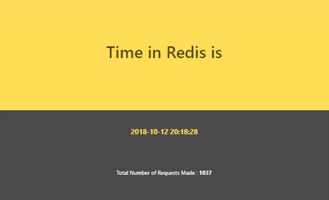
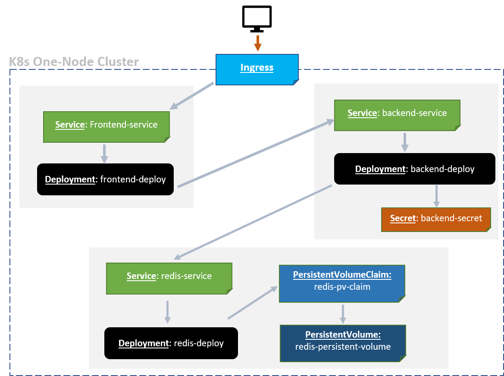

# Objective

Run a full-stack web application that resides inside a kubernetes cluster.

# Plan
    
The final result should be as follows:



Thus, there will be #3 applications:

- **Frontend  (HTML/Js)**

- **Backend (Springboot)**

- **Datastore  (Redis)**

        
The interaction between the apps should be as follows :

```text
               |
               | 
  Browser -->  Frontend -----> Spring ------> Redis
               |
               |
```
    
The #3 apps source code can be found here [applications/](applications/). 


# Kubernetes : Defining Cluster State

Kubernetes uses objects to manage the state of the cluster. The following object kinds will be used:

 - Ingress
 - Deployment
 - Secret
 - Service
 - Persistence Volume Claim
 - Persistent Volume

The following diagram depicts how objects are linked :


 
           
           
All objects definitions can be found in [kubernetes/](kubernetes/)
 
# Getting Started : Setup

Debian-based Linux :
     
An Ansible playbook was written to take care of cluster setup.
     Following commands are enough to execute all necessary steps :
     
```console
$ git clone https://github.com/Elgarni/minimal-kubernetes-cluster.git
$ cd minimal-kubernetes-cluster/ansible
$ sudo chmod +x setup.sh
$ ./setup.sh
```

The Ansible Playbook parts can be found at [ansible/](ansible/)

# Final Note
This project's sole purpose is to showcase a running kubernetes cluster with minikube. Several parts could have been written in a better way, but it was kept simple for brevity.
